# Schema Translator

> AI-powered multi-tenant query system that translates natural language questions into database-specific SQL across heterogeneous schemas using FIBO ontology standards.


---

## The Problem

Enterprise SaaS platforms serve multiple clients, each with completely different database schemas for the same business concepts. A query like "Show contracts over $500k" requires writing custom SQL for every client database:

```sql
-- Client A (e-commerce)
SELECT * FROM contracts WHERE contract_value > 500000;

-- Client B (SaaS, normalized schema with joins)
SELECT h.*, f.arr * (f.term_months/12.0) as total_value
FROM contract_headers h
JOIN contract_financial_terms f ON h.id = f.contract_id
WHERE f.arr * (f.term_months/12.0) > 500000;

-- Client C (different terminology)
SELECT * FROM agreements WHERE total_fees > 500000;
```

**This doesn't scale.** Each new client requires rewriting every query. Schema changes break everything.

---

## The Solution

**Schema Translator** creates a semantic abstraction layer grounded in industry-standard FIBO (Financial Industry Business Ontology), enabling:

✅ **Write once, run everywhere** - Single natural language query works across all client databases
✅ **Semantic consistency** - Formal ontology ensures "contract value" means the same thing semantically
✅ **Zero query rewrites** - Adding new clients requires only schema mapping, not query changes
✅ **Automatic translation** - AI translates business intent to client-specific SQL
✅ **Sub-second performance** - Cached mappings and parallel execution across all clients

### Architecture Overview



**How it works:**
1. User asks: *"Show contracts over $500k"*
2. System maps to canonical FIBO concept: `contract.total_value` → `fibo:hasContractValue`
3. Client-specific mappings translate to appropriate SQL (direct field, calculated, or join)
4. Parallel execution across all capable clients
5. Unified results returned in <100ms (cached) or ~2.5s (uncached)

---

## Key Features

### Natural Language Querying
```
"Show me all active contracts"
"Contracts expiring in the next 90 days"
"Show contracts worth over $500,000"
"Which clients have contracts ending this quarter?"
```

### FIBO Ontology Foundation
- Grounded in formal [Financial Industry Business Ontology](https://spec.edmcouncil.org/fibo/)
- Industry-standard terminology for contracts, parties, financial terms
- Semantic interoperability (RDF, JSON-LD, SPARQL compatible)
- Extensible to other domains (eProcurement, Schema.org, LKIF)

### Flexible Schema Mapping
Supports diverse client database structures:
- **Direct mapping**: Simple 1:1 column mapping
- **Calculated fields**: Complex formulas (`arr * term_months / 12`)
- **Join-based**: Data across multiple normalized tables
- **Graceful degradation**: Auto-skip clients missing required fields

### Performance Optimized
- **Pre-computed mappings**: Generated once, validated, cached
- **Dictionary-based query cache**: 60-80% hit rate, <1ms response
- **Parallel execution**: Query all clients simultaneously
- **Query-aware optimization**: Only load relevant schema definitions

### Human-Reviewable Artifacts
```yaml
canonical_mappings:
  contract:
    total_value:
      type: calculated
      formula: "financial_terms.arr * (financial_terms.term_months/12.0)"
      requires_join: [contract_financial_terms]
      ontology_alignment: "fibo:hasContractValue"
      note: "Calculate total value from ARR and term"
```
- YAML-based mappings for easy review and version control
- Embedded FIBO ontology annotations
- Pydantic validation ensures correctness
- Git-friendly diffs

---

## Tech Stack

**Backend:**
- Python 3.10+
- FastAPI (async API framework)
- SQLAlchemy (multi-database support)
- Pydantic (schema validation)

**AI/ML:**
- Azure OpenAI (GPT-4 for semantic translation)
- Structured output with JSON schema enforcement
- Low-temperature settings (0.1) for consistency

**Data:**
- SQLite (demo databases)
- SQL Server support (production-ready)
- YAML-based schema mappings

**Frontend:**
- Simple HTML/JS UI for demo
- Interactive Swagger docs (`/docs`)

---

## Quick Start

### 1. Clone and Setup

```bash
# Clone repository
git clone https://github.com/gramm-ai/schema-transform.git
cd schema-transform

# Create virtual environment
python -m venv venv
source venv/bin/activate  # On Windows: venv\Scripts\activate

# Install dependencies
pip install -r requirements.txt
```

### 2. Configure Environment

Create `.env` file (see `.env.template`):

```bash
AZURE_OPENAI_API_KEY=your_api_key_here
AZURE_OPENAI_ENDPOINT=https://your-endpoint.openai.azure.com/
AZURE_OPENAI_DEPLOYMENT_NAME=gpt-4
ENV=development
DEBUG=True
```

### 3. Run the Application

```bash
# Start API server
uvicorn app.main:app --reload --port 8000

# Open interactive UI
# Navigate to: http://localhost:8000/static/index.html

# Or use Swagger docs
# Navigate to: http://localhost:8000/docs
```

### 4. Try Example Queries

Open the UI and try:
- *"Show me all active contracts"*
- *"Contracts expiring in the next 90 days"*
- *"Show contracts worth over $500,000"*
- *"Which contracts have the highest value?"*

---

## Project Structure

```
schema-translator/
├── app/
│   ├── main.py                 # FastAPI application
│   ├── services/               # Business logic
│   │   ├── query_service.py    # Query translation & execution
│   │   └── mapping_service.py  # Schema mapping management
│   ├── models/                 # Pydantic models
│   └── static/                 # Web UI
├── data/
│   ├── mappings/               # Client schema mappings (YAML)
│   │   ├── client_a.yaml
│   │   ├── client_b.yaml
│   │   └── ...
│   ├── databases/              # SQLite demo databases
│   └── schemas/                # Canonical schema definitions
├── docs/
│   ├── DESIGN.md               # Detailed technical design (1400+ lines)
│   └── assets/                 # Architecture diagrams (SVG)
├── tests/                      # Unit and integration tests
└── requirements.txt
```

---

## Documentation

**For Employers/Reviewers:**
- **[README.md](README.md)** (this file) - Project overview and quick start
- **[DESIGN.md](DESIGN.md)** - Comprehensive technical design (1400+ lines)
  - Semantic challenges and solutions
  - FIBO ontology integration
  - Mapping architecture
  - LLM consistency strategies
  - Performance optimization

**For Developers:**
- **[SETUP.md](SETUP.md)** - Detailed setup instructions
- **Swagger Docs** - http://localhost:8000/docs (when running)
- **Architecture Diagrams** - `docs/assets/*.svg`

---

## Testing

```bash
# Run all tests
pytest

# Run with coverage
pytest --cov=app --cov-report=html

# Run specific test file
pytest tests/test_query_service.py -v
```

---

## Design Highlights

### Challenge: Semantic Heterogeneity
Different clients use different terminology for the same concepts:
- Client A: `contracts.customer_name`
- Client B: `contract_accounts.company_name` (via JOIN)
- Client C: `agreements.client_name`

**Solution:** FIBO ontology provides canonical concept `fibo:hasContractParty/hasLegalName` that all map to.

### Challenge: Diverse Schema Structures
Same data stored completely differently:
- Denormalized (single table)
- Normalized (multiple JOINs)
- Calculated fields (formulas)

**Solution:** Flexible mapping types (direct, calculated, join, unavailable) handle all variations.

### Challenge: LLM Consistency
LLMs are non-deterministic and can produce varying outputs.

**Solution:**
- Low temperature (0.1)
- Structured JSON output with schema enforcement
- FIBO ontology context grounding
- Dictionary-based caching (SHA256 keys)
- Validation with retry loops

See [DESIGN.md](DESIGN.md) for complete technical analysis.

---

## Performance Metrics

| Scenario | Time | Details |
|----------|------|---------|
| **Cached query** | <100ms | 60-80% of queries hit cache |
| **Uncached query** | ~2.5s | LLM translation + execution |
| **4 clients (parallel)** | ~2.5s | Max time, not sum |
| **4 clients (sequential)** | ~10s | Without parallelization |
| **Mapping generation** | 3-4s | One-time per client |

**Cache performance:**
- 60-80% hit rate on typical workloads
- Dictionary-based with SHA256 keys (async-compatible)
- <1ms cache retrieval time

---

## Roadmap

Future enhancements (see [DESIGN.md - Challenge 10](DESIGN.md#next-areas-of-improvements)):

- [ ] Query-aware prompt optimization (80-90% token reduction)
- [ ] Capability-based client filtering (pre-filter before LLM calls)
- [ ] Multi-ontology support (Schema.org, eProcurement, LKIF)
- [ ] Semantic similarity caching (match semantically equivalent queries)
- [ ] Real-time mapping validation (detect schema drift)
- [ ] Enhanced result federation (intelligent cross-client merging)

---

## Contributing

This is a demonstration project showcasing multi-tenant semantic query architecture. Contributions, issues, and feature requests are welcome!

**Development setup:**
1. Fork the repository
2. Create a feature branch (`git checkout -b feature/amazing-feature`)
3. Run tests (`pytest`)
4. Commit changes (`git commit -m 'Add amazing feature'`)
5. Push to branch (`git push origin feature/amazing-feature`)
6. Open a Pull Request

---

## License

This project is provided for demonstration and portfolio purposes.

---

## Contact

**Project Link:** [https://github.com/gramm-ai/schema-transform](https://github.com/gramm-ai/schema-transform)

For questions about implementation details, see [DESIGN.md](DESIGN.md) or open an issue.

---

## Acknowledgments

- [FIBO Ontology](https://spec.edmcouncil.org/fibo/) - EDM Council's Financial Industry Business Ontology
- [FastAPI](https://fastapi.tiangolo.com/) - Modern Python web framework
- [Azure OpenAI](https://azure.microsoft.com/en-us/products/ai-services/openai-service) - LLM infrastructure

---

**Built using Python, FastAPI, and Azure OpenAI**
